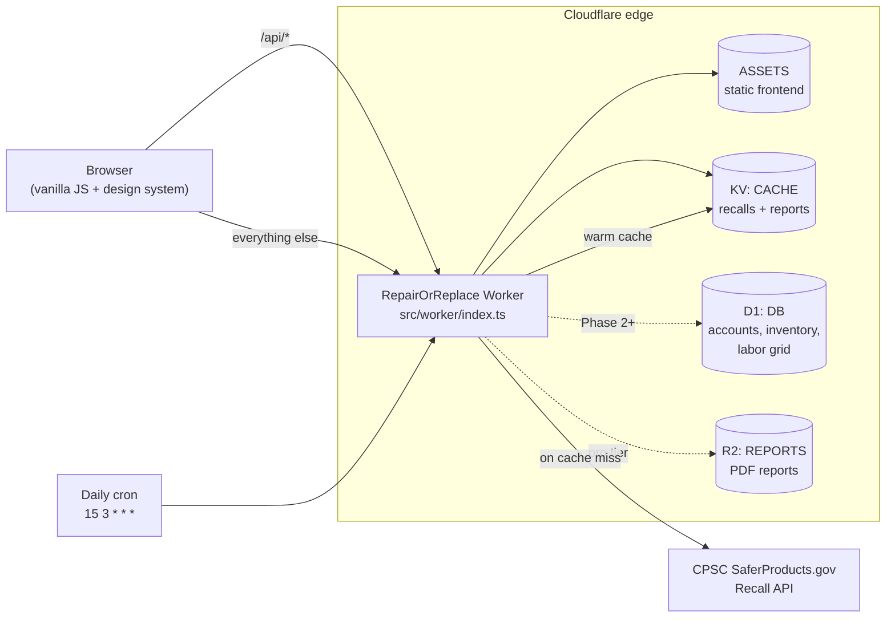
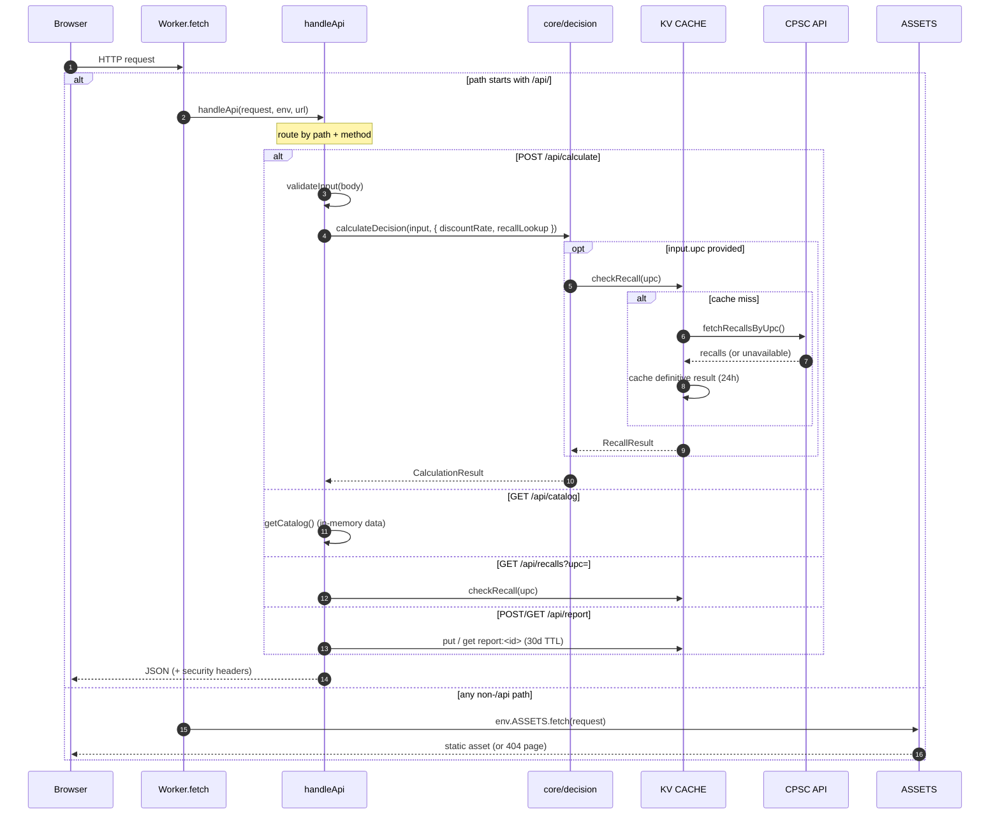
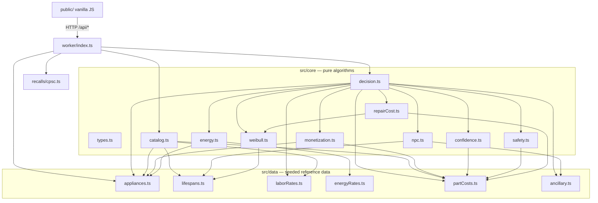

# Architecture

This document describes how RepairOrReplace is put together: the request
lifecycle through the single edge Worker, the layering of the calculation
library, why the math lives in the Worker, the D1 schema, and the KV / R2 / cron
design.

For a feature overview and the API reference, see [`../README.md`](../README.md).
For provisioning and deploy steps, see [`DEPLOYMENT.md`](DEPLOYMENT.md).

---

## 1. Overview

RepairOrReplace is a **single Cloudflare Worker** that does two jobs:

1. Serves the static frontend (HTML/CSS/JS) from the `ASSETS` binding.
2. Runs the `/api/*` compute layer — the NPC + Weibull decision engine and the
   CPSC recall lookups.

There is no separate backend service and no client build step. Slow-changing
federal data is hot-cached in KV and refreshed by a daily cron; D1 holds
relational state (accounts, inventory, the labor grid); R2 is reserved for
generated PDF reports.

---

## 2. Request lifecycle

Every request enters `export default { fetch }` in `src/worker/index.ts`. The
routing decision is deliberately simple: **the Worker owns `/api/*`; everything
else falls through to static assets.**

Key details, all in `src/worker/index.ts`:

- **Routing** is exact-path + method matching in `handleApi`. Unknown `/api`
  paths return a JSON `404`; the whole `/api` branch is wrapped in a try/catch
  that returns a JSON `500` so an error never leaks a stack trace or falls
  through to the asset store.
- **Static fallthrough.** Any path that does not start with `/api/` is handed to
  `env.ASSETS.fetch(request)`. Asset handling (`auto-trailing-slash`, a
  `404-page`) is configured in `wrangler.jsonc`, so editorial pages, the
  calculator UI, and cost guides are delivered straight from the edge with no
  Worker compute.
- **Security headers** (`X-Content-Type-Options: nosniff`, `Referrer-Policy`,
  `X-Frame-Options: DENY`) are attached to every JSON response by the `json()`
  helper.
- **Input validation.** `validateInput` requires a known `category` and a
  non-negative numeric `repairQuote`, and bounds `ageYears`. Everything else is
  optional and defaulted inside the core.
- **The cron entry point** is a separate `scheduled` handler on the same Worker
  (see §6).

---

## 3. Core library layering

The code is layered so that dependencies point in one direction only — data at
the bottom, the Worker at the top — and so the entire calculation is a pure
function of its inputs.

**Layers, bottom to top:**

1. **`src/data/`** — seeded reference tables and their small resolver functions
   (e.g. `resolveLabor`, `resolveEnergyRates`, `getLifespanBand`,
   `getRepairCostBand`). No business logic beyond lookups and regional
   adjustment.
2. **`src/core/` algorithm modules** — each a single, independently testable
   concern: `weibull` (RUL), `repairCost` (expected cost), `energy` (localized
   sub-model), `npc` (present-cost comparison), `safety` (hazard hard-stops),
   `confidence` (scoring + suppression), `monetization` (post-verdict
   placements). They depend on `types.ts` and on `data/`, never on each other's
   internals except where the math genuinely shares a model (`repairCost` reuses
   the Weibull fit).
3. **`src/core/decision.ts` — the orchestrator.** `calculateDecision` resolves
   and defaults the input, runs every sub-model, then applies the verdict logic
   (suppression → recall → warranty → NPC advantage) and assembles the
   self-describing `CalculationResult`, including the `provenance` array.
4. **`src/core/catalog.ts`** — a sibling entry point that projects the same data
   into the shape the intake form needs, so the client never duplicates domain
   data.
5. **`src/worker/index.ts`** — the only layer that knows about HTTP, bindings,
   and async I/O. It injects the async recall lookup into the otherwise-pure
   core via the `recallLookup` option.
6. **`public/`** — the vanilla-JS client. It fetches `/api/catalog` to build the
   form and `POST`s to `/api/calculate` to render the result.

`src/core/index.ts` re-exports the public surface (types, `calculateDecision`,
`getCatalog`, and the individual algorithm functions) so tests and the Worker
import from one place.

---

## 4. Why the calculation lives in the Worker

The decision engine is deliberately **server-side, as one tested source of
truth**, rather than shipped to the browser:

- **Single source of truth.** The same `calculateDecision` runs in Vitest (Node)
  and in production (`workerd`). `test/smoke.test.ts` exercises the exact code
  path the API serves, so a passing test is a real guarantee about the API.
- **Integrity of the verdict.** The neutrality contract — verdict computed
  independently of monetization, DIY suppression on hazards, predatory-quote
  suppression — is only trustworthy if it cannot be tampered with client-side.
- **Data stays server-side.** Cost bands, labor multipliers, and energy rates can
  be refreshed (and eventually moved to D1) without shipping a new client.
- **Portability.** Because the core is pure TypeScript with no Worker or DOM
  dependencies, it can be reused unchanged in a future PDF-report generator or a
  batch landlord tool.

The client's job is limited to collecting inputs and rendering the
already-computed, already-labeled result.

---

## 5. D1 schema

D1 (serverless SQLite, the `DB` binding) holds relational state. The MVP compute
path does **not** read from D1 — the calculator is stateless and reads its
reference data from the in-code `src/data/` modules — but the schema is applied
from `migrations/` so the Phase 2 account model and the eventual live labor grid
have a home.

| Table | Purpose | Phase |
| --- | --- | --- |
| `users` | Registered accounts; `plan` is `free \| premium \| pro`. Anonymous MVP usage writes no rows. | 2+ |
| `appliances` | Saved household appliance inventory — the "digital home hardware" log (brand, model, serial, purchase date, fuel). Cascades from `users`. | 2 |
| `maintenance_alerts` | Proactive maintenance reminders per saved appliance (e.g. condenser-coil clean), with a due date and status. Cascades from `appliances`. | 2 |
| `calculations` | Anonymized calculation log (category, tier, age, fault, quote, metro/state, verdict, NPC figures, confidence) for heuristic calibration. No PII; `user_id` is nullable and set-null on delete. | MVP+ |
| `labor_rates` | Localized labor grid keyed by `metro_slug` (name, state, mean hourly wage, multiplier), seeded from BLS OEWS 49-9031. | MVP seed |
| `zip_metro` | Coarse 3-digit-ZIP → `metro_slug` crosswalk referencing `labor_rates`. | MVP seed |

Migration `0001_init.sql` creates the tables and indexes; `0002_seed_reference.sql`
seeds `labor_rates` and `zip_metro`. Today `laborRates.ts` carries an equivalent
in-code copy of the grid so the calculation is self-contained; the seeded D1
tables are the target for the full production crosswalk, at which point
`resolveLabor` would query `DB` instead of the in-memory map.

---

## 6. KV caching + daily cron recall ingestion

The `CACHE` KV namespace is the hot store for two things: CPSC recall data and
saved reports.

**On-demand recall lookup** (`recalls/cpsc.ts`, `checkRecall`):

- Key `recall:upc:<upc>`. On a hit, return immediately (sub-50ms edge read).
- On a miss, call the CPSC API (`fetchRecallsByUpc`) with a 5-second timeout.
- Cache **definitive** results (`clear` / `active`) for 24h; a transient
  `unavailable` is *not* cached, so it retries sooner.
- Any network/parse failure degrades to `unavailable` with a friendly note — a
  recall lookup never blocks or fails the economic verdict. In `calculateDecision`
  the lookup is wrapped in its own try/catch and only runs when both a `upc` and
  a `recallLookup` are supplied.

**Daily cron ingestion** (`scheduled` handler → `ingestRecentRecalls`):

- Cron `15 3 * * *` (03:15 UTC), declared in `wrangler.jsonc`.
- Pulls recent recalls (default 30-day lookback), stores the recent set under
  `recall:recent` (24h TTL) for a UI feed, and records `recall:lastIngest`.
- Runs inside `ctx.waitUntil(...)` and is best-effort — failures are swallowed so
  the cron never throws. This warms the cache and makes end-user lookups
  resilient to upstream rate limits.

**Saved reports** also live in KV: `POST /api/report` writes `report:<id>` with a
30-day TTL and returns a `/r?id=<id>` share link; `GET /api/report?id=` reads it
back. Using KV keeps report sharing simple and cheap for the MVP.

---

## 7. R2 usage

The `REPORTS` R2 bucket (`repair-or-replace-reports`) is **provisioned but not yet
wired into a route**. It is reserved for the professional tier's generated **PDF
reports** (and, per the binding comment, asset images). Because the calculation
core is pure and portable, a future report generator can render a
`CalculationResult` to PDF and stream it to R2 without touching the decision
logic. Until then, lightweight JSON report sharing is handled by KV (§6).

---

## 8. Edge-cost rationale

The whole design leans on the economics of the Cloudflare edge:

- **One Worker, no origin.** Serving assets and compute from the same Worker
  removes a backend tier entirely. Static, editorial, and cost-guide pages cost
  effectively nothing because they never invoke Worker compute — only genuine
  `/api/*` computation runs code.
- **Cache the slow-moving, compute the rest.** Federal data (recalls, labor
  averages) changes slowly, so it is cached in KV and warmed by a single daily
  cron rather than fetched per request. The calculation itself is cheap CPU with
  no I/O (unless a UPC is supplied), so it runs inline in the request.
- **Cheap catalog.** `GET /api/catalog` is computed from in-memory data and
  served with `Cache-Control: public, max-age=3600`, so the intake form's data
  is cached at the edge and in the browser.
- **Right store for each job.** KV for hot, slow-changing key lookups; D1 for
  relational account/inventory data; R2 for large binary artifacts (PDFs). Each
  binding is used where its cost/latency profile fits, which keeps per-request
  cost low and predictable.
