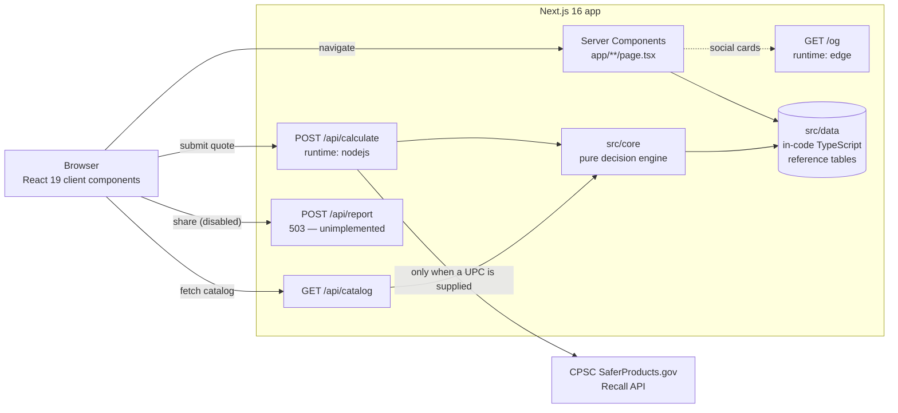
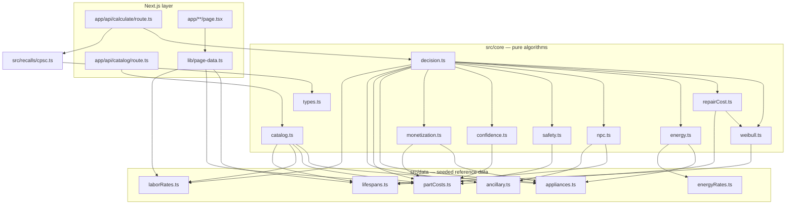

# Architecture

This document describes how RepairOrReplace is put together: the request path
through the Next.js App Router, the layering of the calculation library, why the
math runs on the server, and where the reference data actually lives.

For a feature overview and the API reference, see [`../README.md`](../README.md).

> **Scope note.** Earlier revisions of this project were a Cloudflare Worker
> backed by D1 (SQL), KV (cache), and R2 (object storage), with a daily cron.
> **None of that exists in this repository.** There is no `wrangler.jsonc`, no
> `src/worker/`, no `migrations/`, no `wrangler` dependency, and no deploy
> workflow that would invoke it — `.github/workflows/` contains `ci.yml` and
> nothing else. The documents
> that describe it — [`DEPLOYMENT.md`](DEPLOYMENT.md),
> [`V0-INTEGRATION.md`](V0-INTEGRATION.md),
> [`DEPLOY-BROWSER-GUIDE.md`](DEPLOY-BROWSER-GUIDE.md) — are retained for
> history only and carry deprecation banners. This document describes the code
> that is actually in the tree.

---

## 1. Overview

RepairOrReplace is a **single Next.js 16 application** (App Router, React 19)
that does two jobs:

1. Renders the site — the calculator, the editorial cost guides, the metro cost
   pages, and the legal/about pages — mostly as Server Components, with the
   guide and metro routes prerendered at build time.
2. Serves the `/api/*` compute layer — the NPC + Weibull decision engine, the
   intake catalog, and the optional CPSC recall lookup.

There is no separate backend service, no database, and no cache tier. Every
reference figure is compiled into the bundle from `src/data/`, and the only
outbound network call is the optional CPSC recall lookup.

The request path carries **no persistent state**: a calculation is a pure
function of its request body, and nothing about a request is written to disk or
to any store. It is not, however, entirely memory-free — the rate limiter in
§2 keeps a short-lived per-IP counter in process memory when the deployment
enables it. That counter is the only per-client state in the app, and §5 states
its consequences precisely.



---

## 2. Request path

Routing is the App Router's file-system routing; there is no hand-written
dispatcher. Three Route Handlers live under `app/api/`.

```mermaid
sequenceDiagram
  autonumber
  participant B as Browser
  participant R as Route Handler
  participant Core as core/decision
  participant CPSC as CPSC API

  B->>R: POST /api/calculate
  Note over R: declared Content-Length > 10,000 → 413
  Note over R: >20 req/min per IP → 429<br/>(only when TRUST_PROXY_HEADER=1)
  R->>R: read body; actual bytes > 10,000 → 413
  R->>R: parse + validate body
  alt invalid category or quote <= 0
    R-->>B: 400 { error }
  else valid
    R->>Core: calculateDecision(input, { recallLookup })
    opt input.upc supplied
      Core->>CPSC: fetchRecallsByUpc (5s timeout)
      CPSC-->>Core: RecallResult, or "unavailable" on any failure
    end
    Core-->>R: CalculationResult
    R->>R: strip resolvedInput; mark recall "not_checked" if no UPC
    R-->>B: 200 JSON
  end
```

Key details:

- **Security headers** are applied globally by the `headers()` block in
  `next.config.mjs` — CSP, HSTS, `X-Content-Type-Options`, `Referrer-Policy`,
  `X-Frame-Options`, `Permissions-Policy`, `Cross-Origin-Opener-Policy` — not
  per route. The CSP currently allows `'unsafe-inline'` in `script-src` because
  Next.js injects its hydration payload and the site renders JSON-LD as inline
  `<script>` tags; a nonce-based policy is the documented follow-up.
- **Body-size guard**, in two stages. The declared `Content-Length` is checked
  against a 10,000-byte cap first, so an obviously oversized body is refused
  without reading it; a missing header coerces to `0` and a malformed one to
  `NaN`, and neither rejects at that stage. The body is then read as text and
  its **actual** byte length checked against the same cap before `JSON.parse`,
  which is what genuinely enforces it — a chunked request omits the header, and
  a declared length is trivially lied about. Bounding the *transfer* remains
  the platform's job; this bounds what gets parsed.
- **Rate limiting** is a sliding-window counter (20 requests / 60s per client
  IP) held in a module-level `Map` of IP → request timestamps, with a sweep
  once per window and a hard ceiling of 10,000 tracked clients — cleared
  outright if a flood of unique keys survives a sweep — so it cannot grow
  without bound.

  **It is disabled unless `TRUST_PROXY_HEADER=1`.** The key is the first
  `x-forwarded-for` entry, which only means anything behind a proxy that
  overwrites it. Unproxied, that header is attacker-controlled (rotate it,
  evade the limit) and usually absent altogether, which would collapse every
  visitor into a single bucket and `429` the calculator site-wide after 20
  requests. So the route reads it only on opt-in; otherwise `clientKeyFor`
  returns `null`, the limiter is skipped, and no client state is recorded at
  all.

  Even when enabled, serverless instances do not share memory, so this is an
  interim backstop against one noisy client — **not** a substitute for
  platform-level (WAF/edge) rate limiting, which is the only control at all on
  a deployment that leaves the flag unset.
- **Validation** requires a known `category` and a finite `quote > 0`.
  Everything else is optional and defaulted: `tier` → `mid`, `energyStar` →
  true, an absent `age` is left unset, an unknown `component` lowers confidence
  rather than blocking a result.
- **Error containment.** `calculateDecision` is wrapped in a try/catch that logs
  and returns a generic `500`, so an engine fault never leaks a stack trace.
- **Runtimes.** `/api/calculate` and `/api/report` declare
  `runtime = "nodejs"`. `/api/catalog` declares none and uses the default.
  `/og` declares `runtime = "edge"` because it renders images.
- **`/r` (shared result)** sets `dynamic = "force-dynamic"` and reads `?id=`
  client-side, fetching `GET /api/report?id=`. Since that endpoint is not
  implemented, this path currently always renders its error state.

### Static generation

`app/cost-guides/[slug]` and `app/local-costs/[slug]` both export
`generateStaticParams`, so every guide and metro page is prerendered at build
time from `lib/page-data.ts`. That module is server-only and reads directly from
`src/data/lifespans.ts`, `src/data/partCosts.ts`, and `src/data/laborRates.ts` —
the same tables the calculator uses. Published editorial figures therefore
cannot drift away from the model's figures.

---

## 3. Core library layering

The code is layered so that dependencies point in one direction only — data at
the bottom, HTTP at the top — and so the entire calculation is a pure function
of its inputs.



Every module in `src/core` also imports its shapes from `types.ts`; those edges
are omitted above to keep the graph readable.

**Layers, bottom to top:**

1. **`src/data/`** — seeded reference tables and their small resolver functions
   (`resolveLabor`, `resolveEnergyRates`, `getLifespanBand`,
   `getRepairCostBand`, `getComponent`, `getReplacementAncillary`). No business
   logic beyond lookups and regional adjustment. Plain TypeScript constants,
   compiled into the bundle.
2. **`src/core/` algorithm modules** — each a single, independently testable
   concern: `weibull` (RUL), `repairCost` (expected cost), `energy` (localized
   sub-model), `npc` (present-cost comparison), `safety` (hazard hard-stops),
   `confidence` (scoring + suppression), `monetization` (post-verdict
   placements). They depend on `types.ts` and on `data/`, never on each other's
   internals except where the math genuinely shares a model (`repairCost` reuses
   the Weibull fit).
3. **`src/core/decision.ts` — the orchestrator.** `calculateDecision` resolves
   and defaults the input, runs every sub-model, then applies the verdict logic
   (suppression → recall → warranty → NPC advantage) and assembles the
   self-describing `CalculationResult`, including the `provenance` array. It is
   pure apart from one injected seam: the optional async `recallLookup`.
4. **`src/core/catalog.ts`** — a sibling entry point that projects the same data
   into the shape the intake form needs, so the client never duplicates domain
   data.
5. **`src/recalls/cpsc.ts`** — the CPSC HTTP client. It imports only types from
   the core, so the dependency runs data-ward, not the other way around.
6. **`app/api/*/route.ts` and `lib/page-data.ts`** — the only layers that know
   about HTTP, request validation, and framework concerns. The calculate route
   injects `fetchRecallsByUpc` into the core as the `recallLookup` option and
   maps the engine's output onto the client contract in `lib/result.ts`.
7. **`components/` and `app/**/page.tsx`** — presentation. Client components
   collect inputs and render the already-computed, already-labeled result; they
   import type contracts from `lib/`, never the engine itself.

`src/core/index.ts` re-exports the public surface (all types,
`calculateDecision`, `getCatalog`, and each algorithm function) so tests and
consumers import from one place.

### Contract duplication is deliberate

`lib/catalog.ts` and `lib/result.ts` restate the API's request/response shapes
for the client bundle rather than importing `src/core/types.ts`. That keeps
server-only modules out of the client build while leaving result components
fully typed. The routes are responsible for mapping between the two — see the
projection in `app/api/catalog/route.ts`.

---

## 4. Why the calculation runs on the server

The decision engine is deliberately **server-side, as one tested source of
truth**, rather than shipped to the browser:

- **Single source of truth.** The same `calculateDecision` runs in Vitest and in
  the Route Handler. The suites in `test/` exercise the exact code path the API
  serves, so a passing test is a real guarantee about the API.
- **Integrity of the verdict.** The neutrality contract — verdict computed
  independently of monetization, DIY suppression on hazards, predatory-quote
  suppression — is only trustworthy if it cannot be tampered with client-side.
- **Data stays out of the client bundle.** Cost bands, labor multipliers, and
  energy rates can be refreshed without shipping a larger client.
- **Portability.** The core is pure TypeScript with no framework, DOM, or
  platform dependencies, so it can be reused unchanged in a future PDF-report
  generator or batch landlord tool.

---

## 5. The data layer

There is no database. Reference data lives in six TypeScript modules under
`src/data/`, imported directly and compiled into the build:

| Module | Contents |
| --- | --- |
| `appliances.ts` | Category metadata, representative new-unit prices by tier, energy profiles (old vs. new kWh/therms). |
| `lifespans.ts` | Per-(category, tier) `[low, high]` lifespan bands, read as a Weibull IQR. |
| `laborRates.ts` | Metro list, mean hourly wages, regional multipliers, ZIP and state fallbacks, `NATIONAL_MEAN_WAGE`. |
| `energyRates.ts` | Per-state residential electricity and natural-gas rates with national fallbacks. |
| `partCosts.ts` | Component catalog per category: cost bands, hazard tags, DIY-friendliness, and category default repair costs. |
| `ancillary.ts` | Install, delivery, disposal, and salvage figures for the replacement path. |

**Consequences of this choice, stated plainly:**

- Updating a rate is a code change and a deploy, not a write.
- **Nothing is persisted.** There is no disk, database, or object store behind
  any request; no calculation input, result, or identifier is retained past the
  response. There are no accounts and no sessions.
- The one exception, stated so this document does not contradict §2: the
  **rate-limit counter**. When `TRUST_PROXY_HEADER=1`, `POST /api/calculate`
  holds a client IP and the timestamps of that client's last requests in a
  module-level `Map` inside a single server instance. Entries are dropped once
  their timestamps age out of the 60-second window, the table is bounded at
  10,000 clients, and none of it is written down, logged, or shared between
  instances. With the flag unset, even this is not recorded.
- The whole dataset must stay small enough to bundle. The labor grid is the most
  likely table to outgrow that; when it does, `resolveLabor` is the single seam
  that would move behind a data store.

---

## 6. Recall lookups

`src/recalls/cpsc.ts` wraps the CPSC SaferProducts.gov Recall API.

**On the shipping path:** `fetchRecallsByUpc(apiBase, upc)` (and `parseRecalls`,
which it uses). `app/api/calculate/route.ts` wraps it as `recallLookup` and
passes it into `calculateDecision`, which calls it only when the input carries a
`upc`. Behavior:

- One `GET` to `${CPSC_API_BASE}?format=json&UPC=<upc>` with a 5-second
  `AbortSignal.timeout`.
- The response body is capped at **2 MB**, counted as the chunks arrive and
  aborted mid-stream past the ceiling; the declared `Content-Length` is only a
  fast path, since a chunked response omits it. Without this, a wildcard-
  matching UPC could have the whole recall catalogue buffered into a serverless
  function by `res.json()` before any guard could reject it.
- Any non-OK status, network error, size overrun, or parse failure returns
  `status: "unavailable"` with a friendly note. A recall lookup can never block
  or fail the economic verdict.
- More than 25 matches for a single UPC is treated as an unfiltered upstream
  response and downgraded to `unavailable` rather than reported as an active
  recall. This matters because an active recall **hard-overrides the verdict**;
  without the guard, an upstream that ignored the UPC filter would declare a
  recall for every user.
- The route distinguishes "no UPC supplied" (`not_checked`) from "lookup failed"
  (`unavailable`) so the UI can invite a check instead of showing a false error.

There is **no cache**. Every lookup on the live path is a direct call to
`fetchRecallsByUpc`. The file does export a cached variant, `checkRecall`, but
it takes a `RecallEnv` carrying a `CACHE` binding that nothing in this
deployment constructs, so it is unreachable. Wiring a cache in is a reasonable
future change; no current code path does it.

**Dead code in the same file:** `checkRecall`, `ingestRecentRecalls`, and the
`RecallEnv` interface are leftovers from the Worker architecture — a cached
lookup and a daily ingestion cron — and are called by nothing.

They do, however, **typecheck**. The Cloudflare ambient `KVNamespace` they used
to reference is gone, replaced by a local structural `RecallCache` interface
(`get<T>(key, 'json')` / `put(key, value, { expirationTtl })`) that any store of
that shape satisfies, and `"src/recalls"` is no longer in `tsconfig.json`'s
`exclude` — which now lists only `node_modules` and `test`. The exclusion had
not been protecting anything: `exclude` filters which files TypeScript
*discovers* as roots, not which files enter the program, so the moment
`app/api/calculate/route.ts` imported this module the unresolvable ambient type
broke `tsc` anyway. Replacing the type was the fix; dropping the exclusion is
what made the module genuinely covered.

---

## 7. Testing

`test/` holds twelve Vitest suites, roughly one per core module (`weibull`,
`repairCost`, `energy`, `npc`, `safety`, `confidence`, `monetization`,
`decision`, `cpsc`), plus `smoke` (end-to-end decision runs), `continuity`
(behavior across input boundaries), and `properties` (invariants that must hold
for any input). They import from `src/core` and `src/recalls` directly, with no
HTTP layer in the way. `tsconfig.json` excludes `test/` from the app typecheck;
Vitest type-checks nothing, so type errors in tests surface only at runtime.

CI (`.github/workflows/ci.yml` — the repository's only workflow) runs
`typecheck`, `test`, and `build` on pull requests and pushes to `main`. The
build step is load-bearing: it catches broken imports, invalid route exports,
and static-generation failures that `tsc` alone does not reach. There is no
lint step: Next.js 16 removed `next lint`, and the project carries no ESLint
configuration or dependency, so `tsc --noEmit` under `strict` is the whole
static-analysis gate.

---

## 8. What is roadmap, not architecture

The following are **not built**. There is no schema, no migration, no
persistence layer, and no partial implementation for any of them. They are
listed so the intended shape of the product is legible — not as work in
progress.

| Feature | Status |
| --- | --- |
| Result sharing | `POST /api/report` returns `503`. The `/r` viewer page exists and calls `GET /api/report?id=`, which nothing serves. Needs a persistence choice and one route implementation. |
| Accounts | No auth, no user records, no session. |
| Appliance inventory ("digital home hardware" log) | Not built; requires a database the app does not have. |
| Maintenance alerts | Not built. Depends on inventory. |
| Anonymized calculation logging / heuristic calibration | Not built. No input, result, or verdict is recorded anywhere — the rate-limit counter in §2 holds request timestamps only, never payloads. |
| Landlord & pro tiers, generated PDF reports | Not built. `/for-technicians` is an editorial page, not a product surface. |

Because the calculation core is pure and framework-free, each of these can be
added around it without touching the decision logic. That is the main structural
benefit of the current layering, and the reason to keep `src/core` free of
framework and I/O dependencies.
